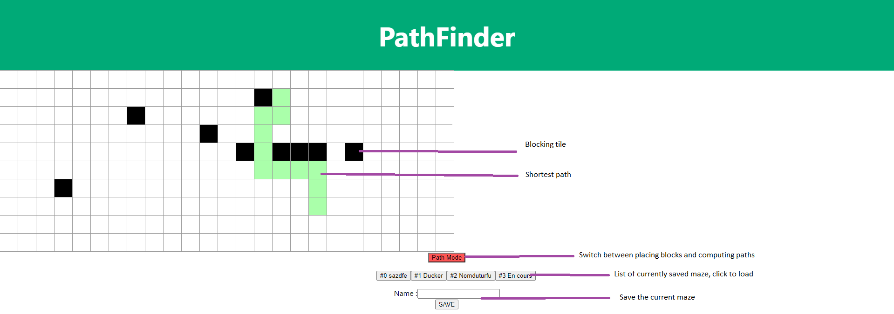

#Presentation 


*Pathfinder website*

This sample project is meant as an initiation to a JS, full-stack, microservices-oriented, application. 
The two ends of the stack are a web-page offering to draw 2D mazes on a grid, and a mongo database allowing to store these grids. 
The access to the database is managed by a nodeJS microservice exposing a gRPC interface. A JSON-REST gateway interfaces the frontend and this storage service. 
All the components can be deployed as container via Docker, and some stack profiles(e.g. database+storage service) can be easily deployed via docker composed.

# Structure
+ **/frontend** A minimal REACT UI to edit 2D grids and draw path between to tiles.
+ **/backend/services** A persistence microservice for ascii grids.
    - **/grid-storage** a node server gRPC microservice exposing a CRUD API for ascii grids
    - **/gateway** a node server acting a a reverse proxy from http front request to gRPC servers
    - **/grpc** grpc hello-world (TO BE REMOVED SOON)
    - **/compose** docker compose stacks to debug locally, run ci tests or deploy the service along with it's related mongo database

# Build docker images
On Windows (powershell): ```build_images.ps1```

On Windows (cmd): ```build_images.cmd```

On Linux : ```bash build_images.sh```

# Demonstration : Run the frontend/backend/db stack locally
+   Deploy : 
    ```
    docker compose -f ./compose-stack-local.yml up -d
    ```
    Website will be available in your browser at localhost:5000, backend rest api will be reachable at localhost:8888/grid, backend gRPC server at localhost:9999

+   Undeploy:
    ```
    docker compose -f ./compose-stack-local.yml down
    ```

